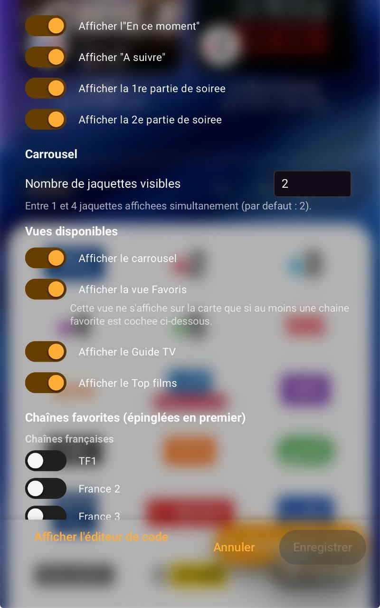
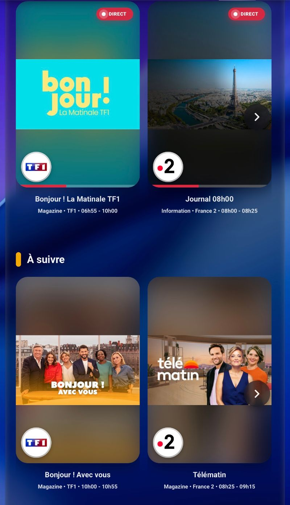

# Programme TNT FR

[](https://github.com/cyclope205/programme-tnt-fr/releases)
[](https://github.com/cyclope205/programme-tnt-fr/actions/workflows/validate.yml)
[](https://github.com/cyclope205/programme-tnt-fr/actions/workflows/tests.yml)
[](LICENSE)
[](https://github.com/hacs/integration)

### ☕ Merci aux donateurs

<!--START_SECTION:paypal-->

- 💙 J***** · 5,00 € · 25/09/2026
  > Merci, super intégration ! <!-- order:22278915JM1987906 -->
- 💙 J***** · 5,00 € · 25/09/2026
<!--END_SECTION:paypal-->

<!--START_SECTION:buy-me-a-coffee-->
<!-- Les nouveaux dons seront ajoutés ici automatiquement -->
<!--END_SECTION:buy-me-a-coffee-->

---

[](https://bmc-eight-red.vercel.app/api/donate?repo=programme-tnt-fr) [](https://bmc-eight-red.vercel.app/api/paypal?repo=programme-tnt-fr&amount=5)


Intégration Home Assistant qui récupère le programme TV des chaines françaises (TNT + une sélection de chaines supplémentaires) et l'affiche dans une carte Lovelace : favoris, carrousel, guide TV complet par chaine et classement des films les mieux notes.

## Sommaire

- [Fonctionnalites](#fonctionnalites)
- [Captures d'ecran](#captures-decran)
- [Installation](#installation)
- [Configuration](#configuration)
- [Utilisation dans un tableau de bord](#utilisation-dans-un-tableau-de-bord)
  - [Options d'affichage](#options-daffichage)
- [Attributs disponibles](#attributs-disponibles)
- [A savoir](#a-savoir)

## Fonctionnalites

-------------------------------------------------------------------------------------------------------------------------------------------------------------------
### Carrousel

Pour chaque chaîne suivie, la carte affiche jusqu'à 4 programmes : celui en cours, celui à suivre juste après, la premiere partie de soirée et la deuxième partie de soirée. Chaque vignette montre l'affiche du programme récupérée sur TMDB quand une correspondance fiable est trouvée, sinon l'icone fournie par le flux TV), le titre, la catégorie, la chaine et l'horaire. Un programme en cours de diffusion affiche un badge "Direct" et une barre de progression. Cliquer sur une vignette ouvre le détail du programme (synopsis, et note TMDB avec lien vers la fiche quand une correspondance est trouvée).

-------------------------------------------------------------------------------------------------------------------------------------------------------------------
**Chaines favorites** : une chaine marquée comme favorite (option `favorite_channels`) est épinglée en tête du carrousel et affiche une étoile sur ses vignettes, pour la retrouver immédiatement sans faire défiler toutes les chaines suivies.

-------------------------------------------------------------------------------------------------------------------------------------------------------------------
**Rangée « à suivre »** : sous « En ce moment », une deuxième rangée affiche le programme qui suit immediatement sur chaque chaine. Elle fonctionne exactement comme les autres rangées (zap sur le logo, clic pour ouvrir le détail) et défile de façon synchronisée avec « En ce moment » : faire glisser l'une des deux rangées fait glisser l'autre en même temps. Elle peut être masquée avec l'option `show_next` (voir [Options d'affichage](#options-daffichage)).

-------------------------------------------------------------------------------------------------------------------------------------------------------------------
### Favoris

Si au moins une chaine favorite est configuree (`favorite_channels`), un bouton "Favoris" apparait dans l'entete de la carte, a cote de Carrousel/Guide TV/Top films. Il affiche la meme vue que le Carrousel (en ce moment / 1ere et 2eme partie de soiree), mais limitee aux chaines favorites, pour retrouver immediatement ses chaines habituelles sans faire defiler les autres.

-------------------------------------------------------------------------------------------------------------------------------------------------------------------
### Guide TV

Le bouton "Guide TV" dans l'entête de la carte bascule vers un guide complet, inspire de l'application Free : deux colonnes de chaines visibles à la fois, défilement horizontal pour changer de chaine (flèches sur ordinateur, glissement au doigt sur mobile/tablette) et défilement vertical pour parcourir la grille chronologique d'une chaine.

Le guide propose quatre filtres, combinables :
- **Recherche** : un champ texte pour ne garder que les chaines dont le nom correspond.
- **Jour** : flèches précédente/suivant pour changer de journée de diffusion.
- **Horaire** : un menu pour n'afficher que les programmes d'une plage donnée (00h-06h, 06h-12h, 12h-16h, 16h-19h, 19h-21h, 21h-00h), pour retrouver rapidement un moment de la journée sans faire défiler toute la liste.
- **Genre** : un menu pour ne garder que les programmes d'un type donne (Film, Série, Sport, etc.).

Un clic sur "Carrousel" dans l'entête revient a la vue de départ.

-------------------------------------------------------------------------------------------------------------------------------------------------------------------
### Top films

Un bouton dans l'entête de la carte ouvre le classement des films les mieux notes (TMDB) en 1ere partie de soirée, navigable jour par jour sur environ une semaine — la même logique que la carte markdown ci-dessous, mais sans se limiter au soir même.

-------------------------------------------------------------------------------------------------------------------------------------------------------------------
### Rappels

Depuis le détail d'un programme (clic sur une vignette), un bouton propose d'être notifié 5, 10 ou 15 minutes avant le début. Le rappel est conservé même si Home Assistant redémarre entre-temps, peut être annulé à tout moment depuis la même fiche, et ne s'affiche pas pour un programme déjà en cours de diffusion. Il peut être envoyé sous forme de notification (mobile, Alexa...) et/ou annoncé vocalement sur une enceinte ou une TV (`media_player`) via la synthèse vocale de Home Assistant.

Des **profils de rappel** peuvent être créés depuis les options de l'intégration : chaque profil (ex. "Fred", "Ginie") regroupe le nom d'une personne et ses propres appareils à notifier, pour que chacun reçoive ses rappels sur son téléphone/enceinte plutôt que sur les cibles globales. Un menu déroulant dans la fiche du programme permet de choisir le profil (ou "Par défaut") avant de programmer le rappel.

-------------------------------------------------------------------------------------------------------------------------------------------------------------------

### Zap TNT

Sur chaque vignette du carrousel, le logo de la chaîne peut devenir un bouton de zap : un clic appelle un script Home Assistant dédié à cette chaîne (via `script.turn_on`), par exemple pour changer la chaîne sur ta télé ou ta box. La carte ne contient aucune logique propre à une marque de box ou de TV : c'est toi qui associes, dans la config de la carte (`zap_channel_scripts`), quelle chaîne correspond à quel script — et c'est ce script, que tu dois avoir créé et testé toi-même au préalable, qui sait comment zapper sur ton propre matériel.

Le zap fonctionne sur le Carrousel/Favoris (logo sur la jaquette) et sur le Guide TV (logo en haut de chaque colonne de chaîne). Le logo n'est cliquable que pour les chaînes présentes dans cette configuration : les autres restent de simples logos, sans effet au clic. Voir [Options d'affichage](#options-daffichage) pour la configuration complète.

-------------------------------------------------------------------------------------------------------------------------------------------------------------------
## Captures d'ecran

Ecran de configuration des chaines suivies :


Options d'affichage de la carte (dont « À suivre ») et chaines favorites regroupees par pays dans l'editeur visuel (v2.5.1) :



-------------------------------------------------------------------------------------------------------------------------------------------------------------------
Rangees "En ce moment" et "A suivre" synchronisees, et date de diffusion d'origine dans le detail du programme (v2.5.1) :



-------------------------------------------------------------------------------------------------------------------------------------------------------------------
Vue "En ce moment" / "1ere partie de soirée" avec jaquettes TMDB :


-------------------------------------------------------------------------------------------------------------------------------------------------------------------
Vue "2eme partie de soirée" :


-------------------------------------------------------------------------------------------------------------------------------------------------------------------
Guide TV, avec le "filtre horaire" :


-------------------------------------------------------------------------------------------------------------------------------------------------------------------
Configuration des chaines favorites:


-------------------------------------------------------------------------------------------------------------------------------------------------------------------
Carrousel avec une chaine favorite épinglée et son étoile:


-------------------------------------------------------------------------------------------------------------------------------------------------------------------
Vue Favoris :


-------------------------------------------------------------------------------------------------------------------------------------------------------------------
Guide TV avec le filtre "Genre" appliqué:


-------------------------------------------------------------------------------------------------------------------------------------------------------------------
Vue Top films avec la navigation jour par jour:


-------------------------------------------------------------------------------------------------------------------------------------------------------------------
Bouton de rappel dans le détail d'un programme :


-------------------------------------------------------------------------------------------------------------------------------------------------------------------
Configuration des appareils de notification et de l'annonce vocale :


-------------------------------------------------------------------------------------------------------------------------------------------------------------------
Gestion des profils de rappel (ajout/édition) :


-------------------------------------------------------------------------------------------------------------------------------------------------------------------
Sélection d'un profil dans la fiche du programme avant de programmer un rappel :


-------------------------------------------------------------------------------------------------------------------------------------------------------------------
Configuration du zap TNT (zap_channel_scripts) et rendu dans le carrousel :


## Installation

1. Ajouter ce depot a HACS comme depot personnalise :

   [](https://my.home-assistant.io/redirect/hacs_repository/?owner=cyclope205&repository=programme-tnt-fr&category=integration)

2. Télécharger la dernière Version de Programme TNT FR.
3. Redémarrer Home Assistant.
4. Ajouter l'intégration via **Paramètres > Appareils et services > Ajouter une intégration > Programme TNT FR**.

La carte Lovelace est enregistree automatiquement par l'intégration : aucune ressource a déclarer à la main.

**⚠️ La carte affiche « Erreur de configuration : Custom element doesn't exist: programme-tnt-fr-card » juste apres l'installation ?** C'est normal, le temps que le navigateur recharge le cache : faites **Ctrl+F5** sur navigateur (rechargement force), ou **fermez completement puis relancez l'application Home Assistant Companion** sur mobile. La carte s'affiche ensuite normalement.

-------------------------------------------------------------------------------------------------------------------------------------------------------------------
## Configuration

A l'ajout de l'intégration, une liste de chaines est proposée (les chaines de la TNT francaise sont selectionnées par defaut, une selection plus large de chaines est également disponible). La selection peut être modifiée à tout moment depuis les options de l'intégration, sans avoir à la réinstaller. Depuis la version 2.5.1, les chaines francaises et les chaines belges (RTBF) sont presentees dans deux listes distinctes, aussi bien a l'ajout de l'integration que dans ses options.

Une cle API TMDB partagee est fournie par defaut pour recuperer les jaquettes (voir Fonctionnalites) : aucune configuration n'est necessaire pour en beneficier. Si vous le souhaitez, vous pouvez renseigner votre propre cle dans les options de l'integration (champ "Cle API TMDB personnelle", section General) - elle sera alors utilisee a la place de la cle partagee.

Les chaines favorites se choisissent depuis la configuration de la carte (option `favorite_channels`, en YAML ou via l'éditeur visuel) : cette sélection est facultative et n'affecte que l'ordre d'affichage dans le carrousel.

Les appareils utilisés pour les rappels se configurent via des **profils de rappel**, depuis les options de l'intégration (menu "Profils de rappel" puis "Ajouter un profil") : chaque profil a un nom (ex. "Fred", "Ginie"), un ou plusieurs appareils à notifier, une ou plusieurs enceintes/TV (`media_player`) pour une annonce vocale (avec le moteur de synthèse vocale TTS de votre choix), les deux pouvant être combinés. Un appareil Alexa déjà choisi comme notification (il parle déjà le message via son propre système) n'a pas besoin d'être ajouté une seconde fois côté `media_player` pour ce même profil - l'intégration bloque d'ailleurs cette combinaison pour éviter d'entendre le rappel deux fois.

Chaque profil peut également définir un volume d'annonce (0 à 100 %) : le volume de l'enceinte/TV ciblée est temporairement réglé sur cette valeur juste avant l'annonce vocale, puis restauré à son niveau d'origine juste après (délai estimé selon la longueur du message). Ce réglage est facultatif : s'il n'est pas défini, aucun changement de volume n'est appliqué.

Pour que plusieurs personnes du foyer reçoivent leurs rappels chacune sur leurs propres appareils, un profil distinct peut être créé pour chacune, avec ses propres cibles indépendantes des autres profils. Le profil est ensuite sélectionnable dans la fiche du programme au moment de programmer le rappel ; sans profil configuré, aucun rappel ne peut être envoyé.### Chaînes disponibles

Liste complète des identifiants `channel_id` utilisés par l'intégration (utile pour repérer une chaîne, ou pour configurer `favorite_channels` / `zap_channel_scripts`).

<details>
<summary>Voir la liste complète des `channel_id` disponibles</summary>

#### Chaînes TNT

| channel_id | Chaîne |
|---|---|
| `TF1.fr` | TF1 |
| `France2.fr` | France 2 |
| `France3.fr` | France 3 |
| `CanalPlus.fr` | Canal+ |
| `France5.fr` | France 5 |
| `M6.fr` | M6 |
| `Arte.fr` | Arte |
| `W9.fr` | W9 |
| `TMC.fr` | TMC |
| `NT1.fr` | TFX |
| `LaChaineParlementaire.fr` | LCP |
| `France4.fr` | France 4 |
| `BFMTV.fr` | BFM TV |
| `CNews.fr` | CNews |
| `CStar.fr` | CStar |
| `Gulli.fr` | Gulli |
| `T18.fr` | T18 |
| `NOVO19.fr` | NOVO19 |
| `TF1SeriesFilms.fr` | TF1 Series Films |
| `LEquipe21.fr` | L'Equipe |
| `6ter.fr` | 6ter |
| `Numero23.fr` | RMC Story |
| `RMCDecouverte.fr` | RMC Decouverte |
| `Cherie25.fr` | RMC Life |
| `LCI.fr` | LCI |
| `FranceInfo.fr` | franceinfo |
| `ParisPremiere.fr` | Paris Premiere |
| `CanalPlusSport.fr` | Canal+ Sport |
| `CanalPlusCinema.fr` | Canal+ Cinema |
| `PlanetePlus.fr` | Planete+ |

#### Chaînes optionnelles (hors TNT)

| channel_id | Chaîne |
|---|---|
| `CanalPlusSeries.fr` | Canal+ Series |
| `CanalPlusDocs.fr` | Canal+ Docs |
| `CanalPlusKIDS.fr` | Canal+ Kids |
| `CanalPlusGrandEcran.fr` | Canal+ Grand Ecran |
| `CanalPlusBoxOffice.fr` | Canal+ Box Office |
| `CanalPlusFoot.fr` | Canal+ Foot |
| `CanalPlusSport360.fr` | Canal+ Sport 360 |
| `CanalPlusLigue1.fr` | Canal+ Ligue 1 |
| `CanalPlusPremierLeague.fr` | Canal+ Premier League |
| `CinePlusPremier.fr` | OCS |
| `CinePlusClassic.fr` | Cine+ Classic |
| `CinePlusClub.fr` | Cine+ Festival |
| `CinePlusEmotion.fr` | Cine+ Emotion |
| `CinePlusFamiz.fr` | Cine+ Family |
| `CinePlusFrisson.fr` | Cine+ Frisson |
| `Eurosport1.fr` | Eurosport 1 |
| `Eurosport2.fr` | Eurosport 2 |
| `beINSPORTS1.fr` | beIN Sports 1 |
| `beINSPORTS2.fr` | beIN Sports 2 |
| `beINSPORTS3.fr` | beIN Sports 3 |
| `RMCSport1.fr` | RMC Sport 1 |
| `RMCSport2.fr` | RMC Sport 2 |
| `RMCSport3.fr` | RMC Sport 3 |
| `DAZN.fr` | DAZN 1 |
| `InfosportPlus.fr` | Infosport+ |
| `GolfPlus.fr` | Golf+ |
| `ChasseEtPeche.fr` | Chasse et Peche |
| `Equidia.fr` | Equidia |
| `ChevalTV.fr` | Cheval TV |
| `DiscoveryChannel.fr` | Discovery Channel |
| `DiscoveryInvestigation.fr` | Discovery Investigation |
| `DiscoveryScience.fr` | TLC |
| `NatGeoWild.fr` | NatGeoWild |
| `NationalGeographic.fr` | National Geographic |
| `Histoire.fr` | Histoire |
| `TouteHistoire.fr` | Toute l'Histoire |
| `UshuaiaTV.fr` | Ushuaia TV |
| `Animaux.fr` | Animaux |
| `Seasons.fr` | Seasons |
| `DisneyChannel.fr` | Disney Channel |
| `DisneyJunior.fr` | Disney Junior |
| `DisneyXD.fr` | Disney XD |
| `Nickelodeon.fr` | Nickelodeon |
| `NickelodeonJunior.fr` | Nickelodeon Junior |
| `Nickelodeon4Teen.fr` | Nickelodeon Teen |
| `CartoonNetwork.fr` | Cartoon Network |
| `Boomerang.fr` | Boomerang |
| `CanalJ.fr` | Canal J |
| `PIWI.fr` | Piwi+ |
| `TIJI.fr` | TiJi |
| `Mangas.fr` | Mangas |
| `TeleToonPlus.fr` | TeleToon+ |
| `MTV.fr` | MTV |
| `MCM.fr` | MCM |
| `M6Music.fr` | M6 Music |
| `NRJHits.fr` | NRJ Hits |
| `Mezzo.fr` | Mezzo |
| `ComediePlus.fr` | Comedie+ |
| `ComedyCentral.fr` | Comedy Central |
| `CrimeDistrict.fr` | Crime District |
| `WarnerTV.fr` | WarnerTV |
| `Syfy.fr` | Syfy |
| `Euronews.fr` | Euronews |
| `France24.fr` | France 24 |
| `RTL9.fr` | RTL9 |
| `TvBreizh.fr` | TV Breizh |
| `PolarPlus.fr` | Polar+ |
| `Teva.fr` | Teva |
| `serieclub.fr` | Serie Club |
| `AB1.fr` | AB1 |

#### Chaînes belges (RTBF)

| channel_id | Chaîne |
|---|---|
| `LaUne.be` | La Une |
| `LaDeux.be` | Tipik |
| `LaTrois.be` | La Trois |

</details>

---


-------------------------------------------------------------------------------------------------------------------------------------------------------------------
## Utilisation dans un tableau de bord

Ajouter une carte manuelle avec :

```yaml
type: custom:programme-tnt-fr-card
```

Aucune autre option n'est nécessaire : la carte trouve elle-même les chaines configurées.

-------------------------------------------------------------------------------------------------------------------------------------------------------------------
### Options d'affichage

#### Sections affichees (En ce moment / 1ere / 2eme partie de soiree)

Par défaut, les quatre sections (En ce moment / À suivre / 1ere partie de soirée / 2eme partie de soirée) sont toutes affichées. Chacune peut être masquée individuellement avec les options suivantes (toutes à `true` par defaut) :

```yaml
type: custom:programme-tnt-fr-card
show_current: true
show_next: true
show_prime_time: true
show_second_part: true
```

Ces options sont également disponibles directement dans l'éditeur visuel de la carte (quatre interrupteurs), pas seulement en YAML : ouvrez l'édition de la carte depuis le tableau de bord, l'éditeur graphique propose les quatre bascules sans avoir a écrire de YAML.

Par exemple, pour masquer uniquement le programme "en ce moment" (comme sur la capture ci-dessous) :

```yaml
type: custom:programme-tnt-fr-card
show_current: false
```


---

#### Masquer la jaquette de la section « à suivre »

Pour la section « à suivre », l'affiche du programme peut être masquée pour ne garder que le texte (titre, chaîne, horaire). Le clic sur la vignette ouvre toujours le détail avec le synopsis.

```yaml
type: custom:programme-tnt-fr-card
hide_next_poster: true
```


Cette option est également disponible dans l'éditeur visuel, juste après les bascules d'affichage des sections.

-------------------------------------------------------------------------------------------------------------------------------------------------------------------

#### Vues affichees (Carrousel / Favoris / Guide TV / Top films)

Les quatre vues de la carte (Carrousel, Favoris, Guide TV, Top films) peuvent elles aussi être masquées individuellement, avec les options suivantes (toutes à `true` par défaut) :

```yaml
type: custom:programme-tnt-fr-card
show_carousel: true
show_favorites: true
show_guide_tv: true
show_top_films: true
```

La vue Favoris ne s'affiche de toute façon que si au moins une chaîne favorite est configurée (`favorite_channels`), même si `show_favorites` vaut `true`. Ces quatre bascules sont également disponibles dans l'éditeur visuel, sous "Vues disponibles". Les boutons de navigation dans l'entête ne s'affichent que si plusieurs vues sont actives à la fois ; si une seule vue reste activée, la carte l'affiche directement sans bouton de navigation (utile par exemple pour n'afficher que le Guide TV sur un écran dédié).

-------------------------------------------------------------------------------------------------------------------------------------------------------------------

#### Nombre de jaquettes par ligne (columns)

Le nombre de vignettes affichées par ligne dans le carrousel se règle avec l'option `columns` (2 par défaut, entre 1 et 4) :

```yaml
type: custom:programme-tnt-fr-card
columns: 3
```

Comme les autres options ci-dessus, `columns` est également réglable directement depuis l'éditeur visuel de la carte (section "Carrousel", champ "Nombre de jaquettes visibles"), sans avoir à écrire de YAML.

Réglage "Nombre de jaquettes visibles" dans l'éditeur visuel, avec 3 jaquettes affichées dans le carrousel :


-------------------------------------------------------------------------------------------------------------------------------------------------------------------

#### Chaines favorites (favorite_channels)

Les chaines favorites, épinglées en tête du carrousel avec une étoile, se configurent avec `favorite_channels` :

```yaml
type: custom:programme-tnt-fr-card
favorite_channels:
  - TF1
  - France 2
```

Comme pour les bascules `show_*`, cette option est aussi accessible depuis l'éditeur visuel de la carte, sans avoir à écrire de YAML : la liste des chaines y est regroupée par pays (« Chaînes françaises » / « Chaînes belges ») pour s'y retrouver plus facilement.

-------------------------------------------------------------------------------------------------------------------------------------------------------------------

#### Zap TNT (zap_channel_scripts)

Le clic sur le logo de chaîne (zap) se configure avec `zap_channel_scripts` : un dictionnaire qui associe l'identifiant de chaîne (`channel_id`, visible dans les [attributs disponibles](#attributs-disponibles)) au script Home Assistant à appeler pour zapper sur cette chaîne. **Chaque script doit déjà exister et avoir été testé de ton côté** : la carte se contente d'appeler `script.turn_on` sur l'entité indiquée, elle ne sait rien de ta box ou de ta TV et n'en crée aucun.

Exemple (remplace ces noms de script par les tiens) :

```yaml
type: custom:programme-tnt-fr-card
zap_channel_scripts:
  TF1.fr: script.zap_tf1
  France2.fr: script.zap_france_2
```

Résultat : logos cliquables sur le carrousel (config ci-dessus) :


Cette option s'applique au logo de chaîne du Carrousel/Favoris et à celui du Guide TV (en haut de chaque colonne). Seules les chaînes présentes dans ce dictionnaire ont un logo cliquable ; les autres restent de simples logos, sans effet au clic. Cette option n'est pas disponible dans l'éditeur visuel : elle doit être ajoutée en YAML.

Voir la liste complète des `channel_id` disponibles dans la section [Configuration](#configuration).

-------------------------------------------------------------------------------------------------------------------------------------------------------------------
## Attributs disponibles

Chaque capteur `sensor.programme_tnt_fr_<chaine>` expose sept attributs de premier niveau : l'identifiant, le nom et l'icône de la chaîne, plus un objet par créneau horaire :

| Attribut | Description |
|---|---|
| `channel_id` | Identifiant technique de la chaîne (ex. `TF1.fr`) |
| `channel_name` | Nom affiché de la chaîne (ex. `TF1`) |
| `channel_icon` | URL de l'icône de la chaîne fournie par le flux, ou `null` |
| `current` | Programme actuellement diffusé |
| `next` | Programme suivant, juste après `current` |
| `prime_time` | Programme de la 1ere partie de soirée |
| `second_part` | Programme de la 2eme partie de soirée |

Chacun de ces quatre objets contient les champs suivants :

| Attribut | Description |
| --- | --- |
| `title` | Titre du programme |
| `subtitle` | Sous-titre / episode |
| `description` | Resume |
| `category` | Categorie XMLTV |
| `icon` | Icone associee |
| `rating` | Classification (ex. age) fournie par le flux XMLTV |
| `date` | Annee ou date de diffusion d'origine du programme, precision variable (issue du flux XMLTV) - egalement utilisee pour fiabiliser le rapprochement TMDB. `null` si absente. |
| `start` / `stop` | Horaires de diffusion (ISO 8601) |
| `poster` | URL de l'affiche recuperee sur TMDB (`null` si aucune correspondance) |
| `tmdb_id` | Identifiant TMDB du film ou de la serie (`null` si aucune correspondance) |
| `tmdb_media_type` | `movie` ou `tv` selon le type de contenu (`null` si aucune correspondance) |
| `tmdb_rating` | Note moyenne TMDB, sur 10 (`0` si aucune correspondance) |
| `tmdb_votes` | Nombre de votes ayant etabli cette note (`0` si aucune correspondance) |

Exemple, pour l'attribut `prime_time` :

```yaml
prime_time:
  title: Le Fabuleux Destin d'Amelie Poulain
  subtitle: null
  category: Film
  poster: https://image.tmdb.org/t/p/w500/xxxxxx.jpg
  tmdb_id: 194
  tmdb_media_type: movie
  tmdb_rating: 7.6
  tmdb_votes: 8500
  start: "2026-08-25T21:05:00+02:00"
  stop: "2026-08-25T23:10:00+02:00"
```

Ces données permettent par exemple de comparer automatiquement les notes TMDB des films diffusés en prime time sur plusieurs chaines, pour ne notifier que le mieux noté.

-------------------------------------------------------------------------------------------------------------------------------------------------------------------
### Exemple : Top 3 films du soir (carte Markdown)

Une carte `type: markdown` standard de Home Assistant suffit à afficher un classement des films les mieux notes en 1ere partie de soirée, toutes chaines confondues. Le titre du classement reprend désormais le nombre réel de films trouvés :

```yaml
type: markdown
content: |
  
  
    
    
      
      
      
      
      
        
      
    
  
  
  
  
  ## 🏆 Top {{ displayed | length }} film{{ 's' if displayed | length > 1 else '' }} suggér{{ 'és' if displayed | length > 1 else 'é' }} ce soir (1ère partie de soirée)
  
  <table width="100%"><tr><td width="{{ (100 / displayed|length)|int }}%" valign="top" align="center"><a href="https://www.themoviedb.org/movie/{{ film.tmdb_id }}"></a><br><b>{{ medals[loop.index0] }} {{ film.title }}</b><br>{{ film.channel }} • {{ film.start | as_timestamp | timestamp_custom('%Hh%M', true) }} • {{ film.rating }}/10</td></tr></table>
  
  Aucun film noté trouvé pour ce soir.
  
```

Aucune configuration nécessaire : le Template parcourt automatiquement tous les capteurs `programme_tnt_fr_*` présents chez l'utilisateur, quelles que soient les chaines sélectionnées à la configuration. Seul le filtre `category == 'Film'` est volontaire : TMDB catalogue parfois des captations de théâtre sous `tmdb_media_type: movie`, ce croisement avec la catégorie XMLTV évite les faux positifs. Chaque jaquette est un lien direct vers sa fiche TMDB (affiche, synopsis complet, casting) : pas besoin de re-chercher le film soi-même pour en savoir plus. Le titre du classement (`{{ displayed | length }}`) reflète désormais le nombre réel de films trouves, plutôt que d'afficher systématiquement "Top 3" même quand moins de films correspondent. La jaquette TMDB du film s'affiche désormais devant chaque titre, quand une correspondance est trouvée.

 


-------------------------------------------------------------------------------------------------------------------------------------------------------------------
## A savoir

- Le flux de programmes est actualise au maximum une fois par heure.
- La recherche d'affiches sur TMDB se fait en arrière-plan après chaque actualisation : juste après un redémarrage de Home Assistant, certaines vignettes peuvent afficher l'icone du flux TV le temps que TMDB réponde, puis se mettre a jour d'elles-mêmes. Cela peut entrainer un temps de chargement qui affiche un message d'erreur de configuration. En patientant un court moment et en actualisant éventuellement la page ou la vue, celle-ci apparaitra.
- Toutes les nouvelles options (`favorite_channels`, filtre Genre, vue Top films, `show_carousel`/`show_guide_tv`/`show_top_films`) sont facultatives : le comportement par défaut de la carte reste inchangé pour les configurations existantes.
- La carte se protège désormais contre un double enregistrement du composant (garde `customElements.get()` avant `customElements.define()`), une cause possible de l'erreur "Custom element doesn't exist" rapportée occasionnellement par certains utilisateurs.
- Le fichier JS de la carte est servi sans en-tete de cache HTTP explicite (`cache_headers=False`), pour reduire le risque que le navigateur garde en memoire une ancienne version de la carte apres une mise a jour. Si la carte ne se met pas a jour visuellement apres une mise a jour HACS (redemarrage effectue), un rechargement force de la page (ou de l'application Compagnon) resout generalement le probleme.
- Un appareil Alexa (Alexa Media Player) choisi comme cible `media_player` pour l'annonce vocale d'un rappel est automatiquement détecté et route l'annonce via son propre service `notify.alexa_media_<appareil>` (donc avec la vraie voix Alexa), plutôt que via la synthèse vocale générique de Home Assistant qui nécessiterait une URL de fichier audio accessible publiquement.
- Le rapprochement des jaquettes TMDB s'appuie désormais aussi sur l'année de diffusion fournie par le flux XMLTV (attribut `date`) quand elle est disponible, en plus du titre, pour fiabiliser le matching des films et séries ayant un remake ou une resortie.
- Pour les formats non-fiction (magazine, information, journal, meteo, sport, divertissement, religion, jeu...), aucune recherche TMDB n'est tentee sur le seul titre : ces formats recurrents n'ont pas d'oeuvre unique correspondante et exposaient a des faux positifs (ex. un magazine associe par erreur a un film homonyme).
- Les problèmes et demandes d'évolution se signalent via l'onglet **Issues** du dépôt.
